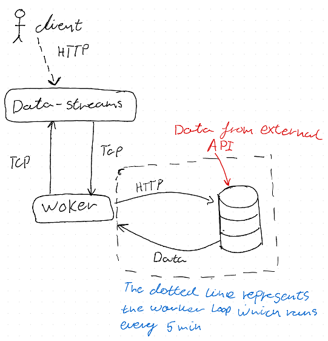

# Apporch to the problem.
The first thing I did before typing any code, was make a quick sketch of the system I wanted to Implement; this was a very rough and high-level depiction of the system. You can see the sketch in the figure below:

The idea with the Data-Streams service is that it shall function as a hybrid, both listing for incoming HTTP requests and being a Microservice.\
I choose TCP as the Transport, to allow communication between the Data-Streams and Worker service. TCP can provide a high performance with low latency and high throughput. Using TCP increases the complexity of the implementation a bit since all error handling should be done manually; TCP is also widely supported and can be somewhat scaled.\
Most of the transporters in NestJS natively support both **request-response** and **event-based** message styles. Here I choose to work with an evet-based style. The reason for this is that the Worker should have a work loop that fetches data from the external API every fifth minute. Here the emit() function from the @nestjs/microservices package is used for event-based messing, allowing me to emit an event every time the Worker service finishes fetching data from the external API. The same messing style is used by the Data-Streams service since it should only send start and stop commands to the Worker service issuing it to start and stop. Thus when sending a start or stop command the Data-streams should not stop and wait for a response, but simply wait for other incoming requests.\
When the Worker service is done fetching data it will emit an event returning the data to the Data-Streams services which then persists the data.\
Since The Worker service emits events to Data-Streams I've also configured a ClientsModule in the `apps/worker/src/worker.module.ts` file.

The data storage option I chose for the Data-Streams service is a relational database. I could have also used a cache or an in-memory database to get faster reads of the data, and then only write the data to disk when taking a backup of the data. Since the idea is to persist the data for longer periods, to provide valuable insights and analytics, I chose to stick with the relational database. The relational database also makes it easy to group related data and categorize the data into different tables depending on the use, providing clean and standardized data for use in e.g. BI tools.\
Implementation-wise, I went with a repository-based implementation. I've therefore implemented a new module called nobel.module.ts, which imports the TypeOrmModule used to instantiate the repository for the entity class modeling the table used to store the data provided by the Worker service. The repository is injected into the nobel.service.ts to auto-generate the queries used for retrieving and persisting the data.\
The module is imported in the app.module.ts file to be used in the Data-Streams service.

# How to run
## Prerequisites to run the application
- Node v. 20.12.7 or higher
- MariaDB (MySQL)

## Steps to run

1. Before running the application you have to create a Database (MariaDB) on your local machine, or some other place, that the application can connect to through the HttpModule which is imported and configured in the `apps/data-streams/src/app.module.ts` file.

### Creating the Database

- On your local machine create a new database (ensure that your DBMS is MariaDB) since the application is configured to use this driver. When creating the database you should do the following:
  1. The database should be called **_dwhCodingInterview_**
     - If you wish to call it something else then remember to change the setting `database: '<your database name>'` in the AppModule class under `apps/data-streams/src/app.module.ts`
  2. Ensure that the database is running on port 3306
     - If your database is running on another port, or you wish to do so, remember to change the setting `port: <database port>` in the AppModule class
  3. The username used for the database is configured to be **_root_** and the password **_admin_**. You can again change these two settings in the AppModule class or configure the database to use the same username and password
  4. Test your connection and start the database.

2. When you have created the database, the next step is to open up two new windows in your favorite terminal. First, navigate to the root folder of the project, in both windows, then in one of the windows run the command `yarn`.

3. When yarn is done running, start the **_data-streams service_** in one of the two windows by running `yarn start`, and the worker class in the other window by running the command `yarn start worker`

4. To issue the worker class to start open a third terminal window and run `curl -X POST http://localhost:3000/start`

5. To retrieve the data that has been persisted by the data-streams service run the following: `curl -X GET http://localhost:3000`.

6. To finally stop the worker class from fetching data run the following `curl -X POST http://localhost:3000/stop`

# Short-comings and future work
## Future work
- The first thing that could be changed for the idealized version that should be pushed to production, would be to change the Transporter that is being used for internal communication between Data-Streams and Worker. Here I would use a message queue (Kafka or rabbitMQ) or RPC (gRPC) since both are easily scalable and reduce complexity, concerning error handling. The performance of RPC would still be high and keep a low latency, but an MQ would introduce some more latency and the performance will depend on the implementation and complexity.

- For some future work one could add a .env file, it would also be easy to store credentials (e.g. password to the database) and keys in this .env file which would get the values from a local variable, so it wouldn't be visible to anyone. It would also make it easier to change configuration options, by storing them in the .env file.

- Better handling of timeouts and retries. Right now the HttpModule is configured in the imports of the worker.module.ts module and is set to timeout a request after 5000 ms. Here there can be done some Improvements by using the nestjs-axios-retrue and Axios-return packages, instead of throwing an error if a request timeout happens. 

- For the configuration of the TypeOrmModule in the app.module.ts module, the synchronize option shouldn't be set to true in production to prevent data loss, performance issues, and lack of control. Instead, it would be wise to implement migrations, which gives more control when making changes to the database.

- Implement some e2e-tests (Integration Tests) for the 2 Microservices and Nobel Module to see how they function together and not just their isolated functionality.

## shortcomings
- I think I could have chosen another API that would contain some more dynamic data, which would allow for a more interesting, transformation of the data being fetched. However, I chose the Nobel prize API, which returns static data, to avoid API keys that should be stored or OAuths, where I needed to handle the storage of credentials.

- Missing Unit test for the Worker Service and Controller classes

- Missing Unit test for the nobel Service and Controller classes